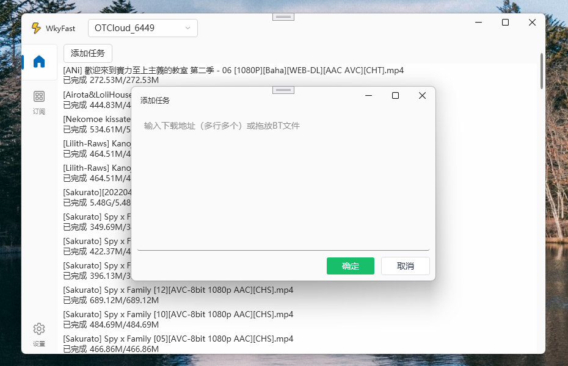

 

 
 

<h2 align="center">WkyFast</h2>

简易玩客云PC客户端，支持批量任务添加和订阅下载  

## ⚠️注意⚠️
**在玩客云在2024年2月29日停止运营，但我开发了新的项目，基于Aria2的订阅下载工具：**
[Aria2Fast](https://github.com/aiqinxuancai/Aria2Fast)

欢迎使用新工具！

#### 2024/03/05 10:24
不行了，**真的连不上了**，不用试了，换Aria2Fast吧

#### 2024/03/04 12:00
好像不退出登录还能用

---

## 功能

注：关键字可使用|来表示或

